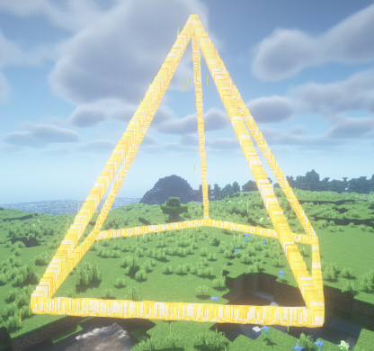

Pyramid 代表一个棱锥特效, 支持设定 边的个数, 高度, 粒子间隔, 半径 相关参数

```java
Pyramid pyramid = new Pyramid(player.getLocation(), 5, 2 ,3);
pyramid.setParticle(Particle.DRIP_LAVA)
       .alwaysShowAsync();
```
其中 上方的代码将会生成一个 **5条边的 半径为2 高度为3** 的正五棱锥

