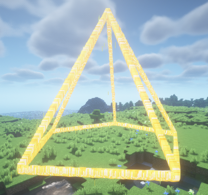
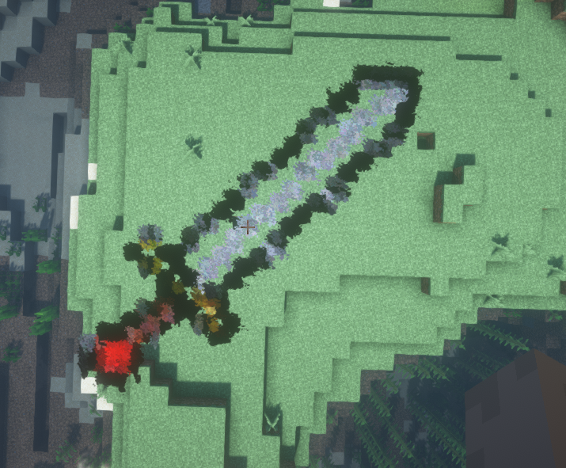

Image 代表一个图片特效, 支持设定 本地图片、网络图片、粒子间距、比例缩小 相关参数
:::danger 危险
请注意, 该粒子特效的 ```calculateLocations``` 方法将会返回 null
:::
下面我们将以这个图片作为演示



```java
Image image = new Image(origin, new File(getDataFolder(), "temp.jpg"), 2, 8);
image.setBypassGrayCheck(false);
image.setPeriod(1);
image.alwaysShowAsync();
```
其中 上方的代码把灰度值检测打开, 越靠近纯白的颜色将会忽略显示

