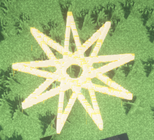

NStar 代表一个奇数角星特效, 支持设定 角的个数, 半径, 粒子间隔 相关参数, 算法基于 45° 角旋转得到

```java
NStar nStar = new NStar(player.getLocation(), 7, 2, 0.02);
nStar.alwaysShowAsync();
```
其中 代码中的参数 7 则表示为 七角星


若想显示 九角星 则可更改为 9

```java
NStar nStar = new NStar(player.getLocation(), 9, 2, 0.02);
nStar.setParticle(Particle.DRIP_LAVA)
     .alwaysShowAsync();
```

