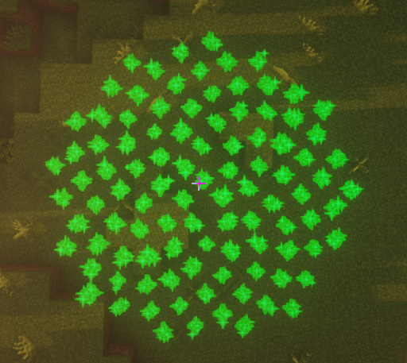

:::tip 提示
该粒子特效已实现 Playable 接口, 支持按 period/tick 进行播放 可以调用以下三个方法

- play() 若特效类已经实现 Playable 接口, 则会出现该方法
- alwaysPlay() 可以使得当前的特效一直进行步进播放, 只不过 ParticleLib 会占用主线程来执行计算
- alwaysPlayAsync() 跟 alwaysPlay 一样, 只不过 ParticleLib 会使用异步的方式来执行计算并显示特效
:::

实心圆在原理上使用极坐标进行生成, 因此生成出来的实心圆的点是比较均匀的

```java
FilledCircle filledCircle = new FilledCircle(player.getLocation(), 3, 100);
filledCircle.alwaysShowAsync();
```


:::tip 提示
实心圆支持在 play 的时候**设置播放时长**, 可调用以下方法
```
time  持续时间, 单位 tick
count 粒子数量

playWithTime(long time, long count)
```
请注意 ```playWithTime``` 方法会忽略 ```setSample``` 和 ```setPeriod``` 的效果

当 time 参数被设置为 0 时则会做 show 的操作, 但会忽略 setSample 的效果
:::

```java
FilledCircle filledCircle = new FilledCircle(player.getLocation(), 3, 100);
filledCircle.playWithTime(10, 1000);
```

上方代码中 ```playWithTime(10, 1000)``` 的意思为: 10 tick 内显示所有 1000 个粒子


