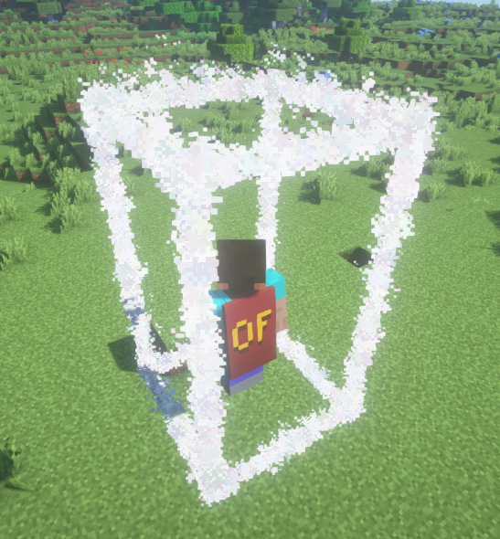

立方体 Cube 特效需要提供空间内任意两点, 即可生成出一个空间的特效

具体效果类似 Residence 圈地后的特效

:::tip 提示 
Cube 支持设置 step 参数来控制粒子间的间距
:::

```java
Location loc1=player.getLocation().add(-1, -1, -1);
Location loc2=player.getEyeLocation().add(1, 1, 1);

Cube cube = new Cube(loc1, loc2);
cube.setPeriod(1L)
    .setColor(Color.WHITE)
    .alwaysShowAsync();
```

