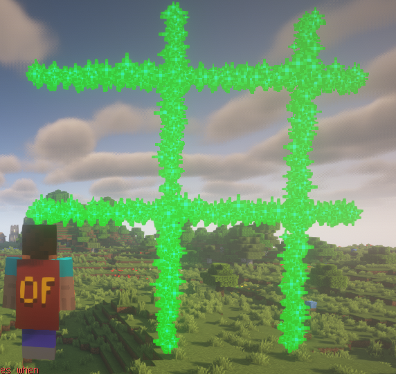
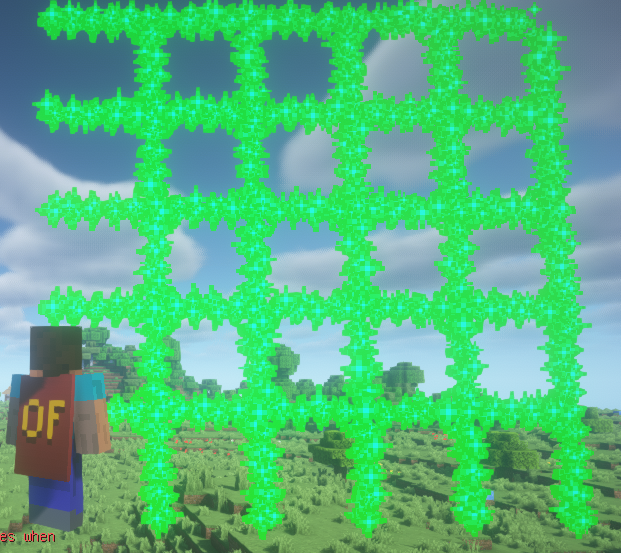

:::danger 提示
该粒子特效的算法比较辣鸡, 1.4 版本之下不建议在实际场景使用
:::

Grid 代表一个网格, 你需要提供两个 **处于相同平面(如X平面)** 的坐标即可生成一个网格, 暂时没想到实际运用场景

```java
Grid grid = new Grid(player.getLocation(), player.getLocation().add(5, 5, 0), 2D);
grid.alwaysShowAsync();
```

第三个参数将会设定 ```gridLength``` 该参数将会影响网格的间隔大小

#### gridLength 为 2 时的效果


#### gridLength 为 1 时的效果
