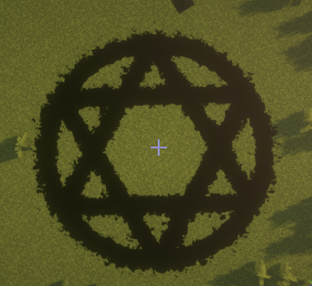

六芒星其实就是一个圆加两个三角形即可
```java
Circle circle = new Circle(player.getLocation(), 1);
Polygon polygon = new Polygon(3, player.getLocation());
Polygon polygon1 = new Polygon(3, player.getLocation());
// 要事先让其中一个三角形旋转180度
polygon1.addMatrix(Matrixs.rotateAroundYAxis(180));
// 利用特效组进行统一设置
new EffectGroup(circle, polygon, polygon1)
        .setColor(Color.BLACK)
        .setPeriod(1)
        .scale(2)
        .alwaysShowAsync();
```

实际运行效果:



:::tip 提示
如果你使用的是 1.4 版本前的 ParticleLib 那么你可能要一步一步设置好参数

```java
Circle circle = new Circle(player.getLocation(), 2);
circle.setPeriod(1)
        .setColor(Color.BLACK);
Polygon polygon = new Polygon(3, player.getLocation());
// 放大
polygon.addMatrix(Matrixs.scale(2, 2, 2))
        .setColor(Color.BLACK);
Polygon polygon1 = new Polygon(3, player.getLocation());
// 对于平面2D图形, 使用 rotate2D 方法也可以
polygon1.addMatrix(Matrixs.rotate2D(180))
        // 放大
        .addMatrix(Matrixs.scale(2, 2, 2))
        .setColor(Color.BLACK);
circle.alwaysShowAsync();
polygon.alwaysShowAsync();
polygon1.alwaysShowAsync();
```
:::
