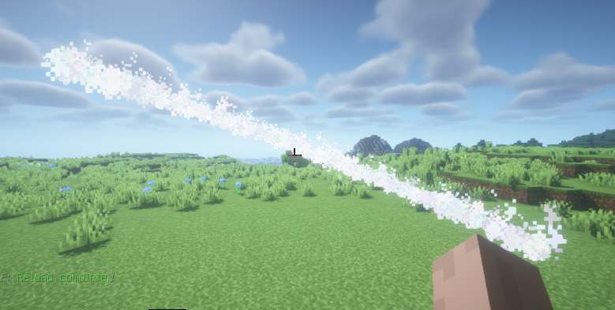

对于类似剑气的效果可以使用一个圆弧实现, 这里我们使用 Arc 进行实现即可

```java
Arc arc = new Arc(origin, 0, 180D, 2)
        .setStep(5D);
// 在 5° 至 30° 之间倾斜
double rot = 5 + Math.random() * (30 - 5 + 1);
// 添加绕Z轴旋转的矩阵进行倾斜, 添加旋转至玩家面前的矩阵
// 此处三元运算用于正负倾斜
arc.addMatrix(Matrixs.rotateAroundZAxis(new Random().nextBoolean() ? rot : -rot))
        .addMatrix(Matrixs.rotateAroundYAxis(-player.getLocation().getYaw()))
        .setColor(Color.WHITE);
arc.alwaysShowAsync();
```

:::info 具体效果

:::