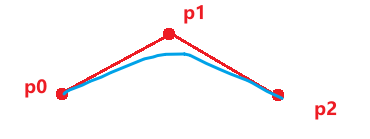
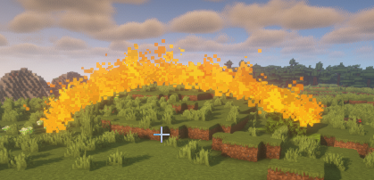

这一段代码使用的是 2阶贝塞尔曲线 具体实现可见贝塞尔曲线的实际算法

原理在于下面这张图



在图中我们将 p0 看为原点, p1 当做最高点, p2 做为终点,

那么贝塞尔曲线将会生成图中的 **蓝线** 部分

```java
Location p0 = player.getLocation.clone();
// 这里将 pitch 设置为 -45 则可以在 getDirection 时取得 一个 斜向上 45度的向量
p0.setPitch(-45);
Location p1 = temp.clone().add(temp.getDirection().multiply(1.5));

// 这里是为了避免受到玩家抬头的影响而使得抛物线畸形, 设置为 0 则为玩家平视
p0.setPitch(0);
Location p2 = temp.clone().add(temp.getDirection().multiply(3));

TwoRankBezierCurve curve = new TwoRankBezierCurve(p0, p1, p2);
curve.setColor(Color.ORANGE)
        .alwaysShowAsync();
```

**由于上方代码当中 并没有取到中点再设置 Y 轴以设置 p1 控制点, 因此下方的图会看起来有点左偏**

:::info 具体效果

:::