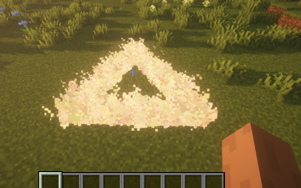

在实际场景内, 有时候 ParticleLib 预制的粒子特效并不会随着玩家视角的旋转进行旋转, 此时我们可以使用旋转矩阵

例如我们想让一个三角形跟玩家的朝向相同可以这样做

```java
Polygon polygon = new Polygon(3, player.getLocation());
polygon.addMatrix(Matrixs.rotateAroundYAxis(-player.getLocation().getYaw() + 30))
        .setColor(Color.WHITE);
polygon.alwaysShowAsync();
```

在上方的代码中首先是让粒子特效按 Yaw 旋转, 之后再经过微调的方式将特效旋转至所需要的位置

因为 ParticleLib 当中的三角形的三个点的三个角的角度为, 0° 120° 240°

因此生成出来的三角形是朝向X轴的正半轴, 而要让他指向玩家朝向 也就是 90° 角, 只需要 120° 旋转 30° 即可

:::info 具体效果

:::

