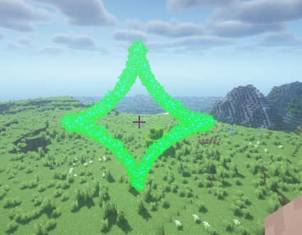
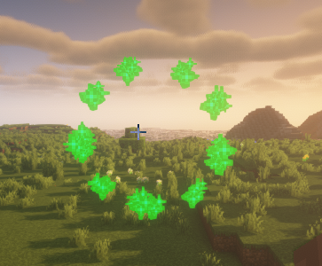
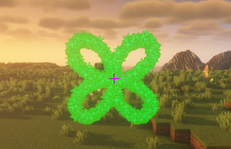

:::tip 提示
该粒子特效已实现 Playable 接口, 支持按 period/tick 进行播放 可以调用以下三个方法

- play() 若特效类已经实现 Playable 接口, 则会出现该方法
- alwaysPlay() 可以使得当前的特效一直进行步进播放, 只不过 ParticleLib 会占用主线程来执行计算
- alwaysPlayAsync() 跟 alwaysPlay 一样, 只不过 ParticleLib 会使用异步的方式来执行计算并显示特效
:::

函数渲染器即为开发者通过给定一个函数与相关参数, EquationRenderer 则会把函数图像给描绘出来

:::tip 提示
函数渲染器支持设定的相关参数包括
- 参数的步进
- 参数的最大最小值
- 等

**一般函数渲染器和极坐标函数渲染器 都是以 XY 平面作为水平面, 想改的话可以自行更改源码, 参数方程渲染器支持 x y z 三个坐标都给定函数**
:::

# 普通函数渲染器
一般函数渲染器是基于 ```y = f(x)``` 的函数进行的渲染

例如简单的 ```y = x^2``` 则为抛物线可见如下的实现

```java
GeneralEquationRenderer renderer = new GeneralEquationRenderer(player.getLocation(), x -> {
    return Math.pow(x, 2);
});
renderer.alwaysShowAsync();
```
实际效果为:


> 图中的红点为 player.getLocation 的点, 即原点

由于普通函数渲染器默认参数为
- minX: -5 表示函数中 x 的最小值
- maxX: 5 表示函数中 x 的最大值
- dx: 0.1 表示函数中 x 的改变量, 即每一次显示粒子时的改变量

因此在上图看出来的函数图像比较的**高且密集**, 因此我们可以修改一下参数可得下面的结果

```java
GeneralEquationRenderer renderer = new GeneralEquationRenderer(player.getLocation(), x -> Math.pow(x, 2));
renderer.setMinX(-3)
        .setMaxX(3)
        .setDx(0.3);
renderer.alwaysShowAsync();
```


## 参数方程渲染器
参数方程渲染器 支持 x y z 三轴(MC中)都给定方程, 即可以实现

```
x = f(t)
y = g(t)
z = h(t)
```
默认 t 的取值范围为 ```[0, 360]``` dt 为 1

以下例子都实现于XY平面当中

```java
ParametricEquationRenderer renderer = new ParametricEquationRenderer(player.getLocation(), t -> 2 * Math.pow(Math.cos(t), 3), t -> 2 * Math.pow(Math.sin(t), 3));
renderer.alwaysShowAsync();
```



```java
ParametricEquationRenderer renderer = new ParametricEquationRenderer(player.getLocation(), Math::cos, Math::sin);
renderer.setDt(30);
renderer.alwaysShowAsync();
```



## 极坐标方程渲染器
:::tip 提示
极坐标支持设定的参数为

- minTheta θ 的最小值, 默认为 0
- maxTheta θ 的最大值, 默认为 360
- dTheta θ 的该变量, 默认为 1
:::

以四叶玫瑰线为例 ```ρ=a*sin(2θ)``` 取 a 为 1.5 则有如下图像

```java
PolarEquationRenderer renderer = new PolarEquationRenderer(player.getLocation(), theta -> {
    return 1.5 * Math.sin(2 * theta);
});
renderer.alwaysShowAsync();
```

