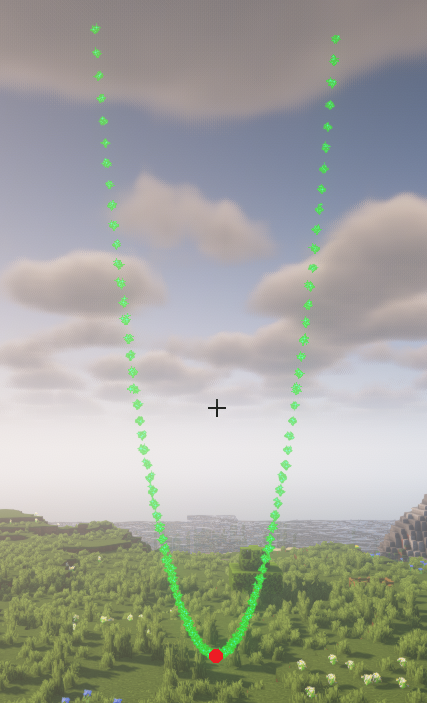
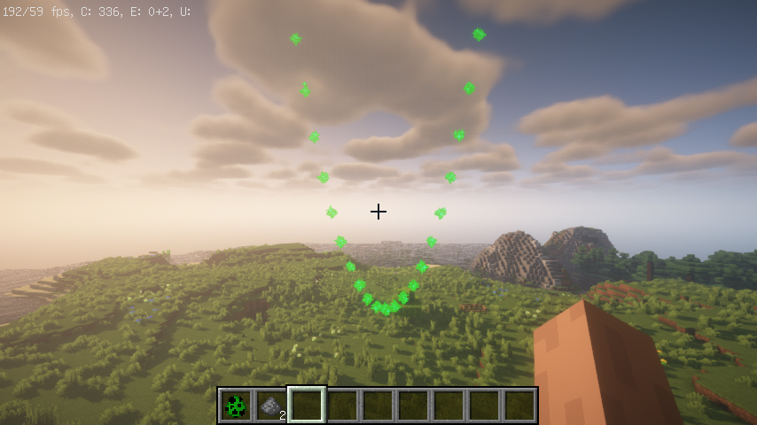

函数渲染器即为开发者通过给定一个函数与相关参数, EquationRenderer 则会把函数图像给描绘出来

:::tip 提示
函数渲染器支持设定的相关参数包括
- 参数的步进
- 参数的最大最小值
- 等
:::

# 普通函数渲染器
一般函数渲染器是基于 ```y = f(x)``` 的函数进行的渲染

例如简单的 ```y = x^2``` 则为抛物线可见如下的实现


```java
GeneralEquationRenderer renderer = new GeneralEquationRenderer(player.getLocation(), x -> {
    return Math.pow(x, 2);
});
renderer.alwaysShowAsync();
```
实际效果为:


由于普通函数渲染器默认参数为
- minX: -5
- maxX: 5
- dx: 0.1

因此在上图看出来的函数图像比较的高且密集, 因此我们可以修改一下参数可得下面的结果

```java
GeneralEquationRenderer renderer = new GeneralEquationRenderer(player.getLocation(), x -> Math.pow(x, 2));
        renderer.setMinX(-3)
                .setMaxX(3)
                .setDx(0.3);
        renderer.alwaysShowAsync();
```



## 参数方程渲染器
```java
ParametricEquationRenderer renderer = new ParametricEquationRenderer(player.getLocation(), t -> 2 * Math.pow(Math.cos(t), 3), t -> 2 * Math.pow(Math.sin(t), 3));
renderer.alwaysShowAsync();
ParametricEquationRenderer renderer = new ParametricEquationRenderer(player.getLocation(), Math::cos, Math::sin);
renderer.setDt(30);
renderer.alwaysShowAsync();
```

## 极坐标方程渲染器
```java
PolarEquationRenderer renderer1 = new PolarEquationRenderer(player.getLocation(), theta -> {
    return 1.5 * Math.sin(2 * theta);
});
renderer1.alwaysShowAsync();
```