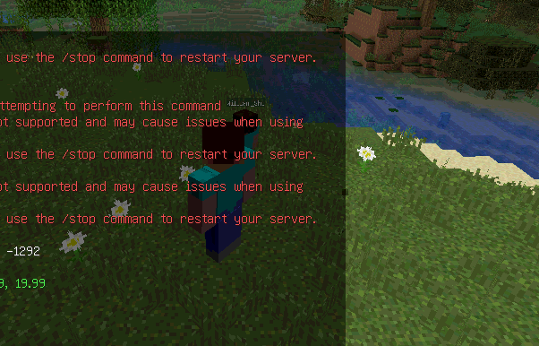
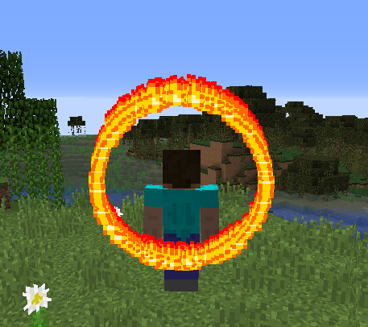
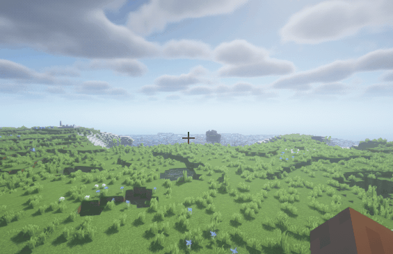

# 坐标器

坐标器是 ParticleLib 当中基于 Player 的视角而建立起一套全新的坐标系

以便于开发者只用学习一般地情况后, 就可写出根据玩家视角变化而变化的粒子特效

:::tip 提示
实现原理和使用方法可以看这个 也是我写的 https://www.jianshu.com/p/eab4355d9251
:::

# 一些例子
## 修正坐标器
```java
Player player = ........
PlayerFixedCoordinate coordinate = new PlayerFixedCoordinate(player.getLocation());

double radius = 10;
for (double t = -1; t <= 1; t += 0.001) {
    double x = radius * Math.sin(t) * Math.cos(t) * Math.log(Math.abs(t));
    double y = radius * Math.sqrt(Math.abs(t)) * Math.cos(t);

    Location loc = coordinate.newLocation(x, y);
    loc.getWorld().spawnParticle(Particle.FIREWORKS_SPARK, loc, 1, 0, 0, 0, 0);
}
```


## 后背坐标器
```java
Player player = (Player) sender;
PlayerBackCoordinate coordinate = new PlayerBackCoordinate(player.getLocation().add(0, 1.6D, 0));

for (int angle = 0; angle < 360; angle++) {
    double radians = Math.toRadians(angle);
    double x = Math.cos(radians);
    double y = Math.sin(radians);

    Location loc = coordinate.newLocation(x, y);
    loc.getWorld().spawnParticle(Particle.FLAME, loc, 1, 0, 0, 0, 0);
}
```


## 玩家面前坐标器
表示一个玩家面前的坐标系, 将玩家面前作为一个新坐标系, 暂时不会受到仰俯角的控制

```java
PlayerFrontCoordinate coordinate = new PlayerFrontCoordinate(player.getEyeLocation());
double radius = 0.5;
double y = 0;
for (int i = 0; i < 360 * 3; i++) {
    double radians = Math.toRadians(i);
    double x = radius * Math.cos(radians);
    double z = radius * Math.sin(radians);

    double radians2 = Math.toRadians(i + 180);
    double x2 = radius * Math.cos(radians2);
    double z2 = radius * Math.sin(radians2);

    y += 0.02;
    loc.getWorld().spawnParticle(Particle.FLAME, coordinate.newLocation(x, y, z), 1, 0, 0, 0, 0);
    loc.getWorld().spawnParticle(Particle.FLAME, coordinate.newLocation(x2, y, z2), 1, 0, 0, 0, 0);
}
```
